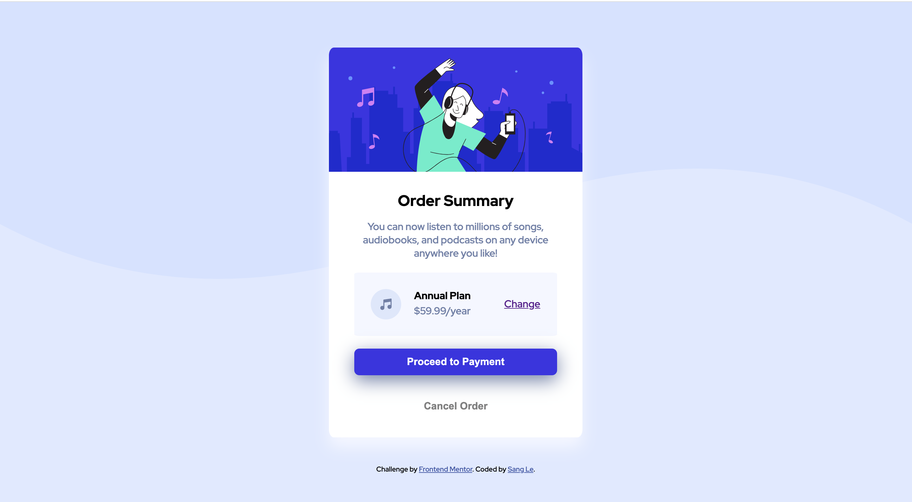

# Frontend Mentor - Order Summary Challenge

### This is a challenge I take from [Order summary card challenge on Frontend Mentor](https://www.frontendmentor.io/challenges/order-summary-component-QlPmajDUj)

### The challenge

Users should be able to:

- See hover states for interactive elements

### Screenshot

### Links

- Solution URL: https://github.com/sqle157/order.github.io
- Live Site URL: https://sqle157.github.io/order.github.io/

### Built with

- HTML
- CSS
- FlexBox

### What I learned

- CSS flexbox layout
- Better understanding of the Box model
- Difference between .svg and other image formats

### Author

- Github - sqle157(https://github.com/sqle157) 

# I hope you guys enjoy it!
